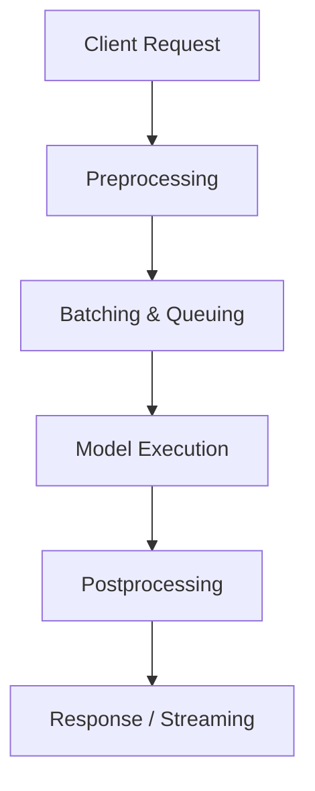

# Inference Lifecycle

> Every production inference request passes through a predictable sequence of stages — understanding them helps you optimize latency, reliability, and cost.

---

## Overview

Even simple APIs (like “classify this image”) go through multiple backend layers before returning a result.

Each stage can fail or add latency — treat them as separate measurable units.

---

## Lifecycle Stages

### **1. Preprocessing**

Converts raw inputs into numerical tensors compatible with the model.

**Example:**
Tokenization for text, resizing for images, or MFCC extraction for audio.

**Typical issues:**

* CPU-bound tokenizers causing slowdowns
* Inconsistent preprocessing between training and inference
* Large payloads clogging input buffers

!!! tip
    Preprocessing should be fast and deterministic — never reimplement training logic ad hoc.

---

### **2. Batching & Queuing**

Aggregates multiple requests into one GPU call to maximize utilization.

**Why it matters:**
GPUs are most efficient with larger batches.
However, waiting too long to fill a batch increases latency.

**Trade-off:**

* Large batch → better throughput
* Small batch → lower latency

**Common pitfalls:**

* Static batch size leading to queue buildup
* Lack of timeout control for unfilled batches

---

### **3. Model Execution**

This is the forward pass — the core inference step.

**What happens:**

1. Inputs are moved to GPU memory
2. The model computes outputs
3. Results are transferred back to CPU

**Failure modes:**

* Out-of-memory (OOM)
* GPU context crashes
* Underutilized GPUs due to poor batching

!!! warning
    This is the most expensive stage — **every optimization here saves real money**.

---

### **4. Postprocessing**

Converts raw tensor outputs into usable formats.

**Examples:**

* Detokenizing LLM outputs into text
* Converting logits into class labels
* Merging detection boxes in CV tasks

**Pitfalls:**

* Decoding inefficiencies
* Loss of precision
* Hard-coded limits truncating outputs

---

### **5. Streaming (Optional)**

For large models (e.g., LLMs), outputs are generated incrementally.

**What happens:**

* Partial tokens or frames are emitted progressively
* Client stays connected (WebSocket or SSE)
* Latency per token becomes the main performance metric

**Common issues:**

* Broken connections under load
* Backpressure when client consumption is slow

---

## Monitoring Each Stage

| Stage          | Key Metric           | Tool / Technique          |
| -------------- | -------------------- | ------------------------- |
| Preprocessing  | CPU time per request | Prometheus, OpenTelemetry |
| Batching       | Queue delay          | Internal metrics          |
| Execution      | GPU utilization      | NVIDIA DCGM, Grafana      |
| Postprocessing | Decode time          | App metrics               |
| Streaming      | Token/s rate         | Logs, OpenTelemetry spans |

!!! tip "Golden rule"
    Never monitor only end-to-end latency — track *per-stage latency* to identify bottlenecks.

---

## Optimization Strategies

| Target                  | Strategy                            | Result                  |
| ----------------------- | ----------------------------------- | ----------------------- |
| CPU-bound preprocessing | Async tokenization, multiprocessing | Lower latency           |
| GPU saturation          | Adaptive batching                   | Better throughput       |
| I/O bottlenecks         | Keep models warm in VRAM            | Fewer cold starts       |
| Postprocessing          | Stream instead of buffer            | Lower perceived latency |

---

## Summary

The inference lifecycle is not just about running a model — it’s about managing a **pipeline of compute and data**.
Every stage contributes to performance and cost.

> Backend developers should treat each stage as a separate observable unit, with its own metrics, timeout, and optimization strategy.

---
