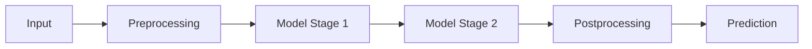

# Model Pipeline

> Sequential orchestration of multiple models for complex tasks.

---

## What is it?

A **pipeline** chains several models together, passing outputs from one to the next.

!!! tip
    Always monitor per-stage latency — bottlenecks often occur in intermediate models.

**Example:**  
Image → Feature Extractor → Embedding Model → Classifier → Final Prediction

---

## Why Use It?

* Handles **multi-stage tasks**  
* Enables **modular model updates** without changing the entire workflow  
* Allows **different models per stage** (CV, embeddings, NLP)  

---

## Backend Considerations

| Aspect          | Recommendation                                  |
| --------------- | ----------------------------------------------- |
| Orchestration   | Async workers, DAGs, or Ray Serve               |
| Latency         | Each stage adds delay; consider batching        |
| GPU allocation  | Pin stages to different GPUs if memory is tight |
| Fault tolerance | Retry failed stages; isolate failures per stage |

---

## Visual Diagram

