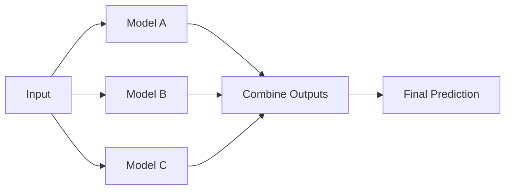

# Model Ensemble

> Parallel execution of multiple models with aggregated outputs.

---

## What is it?

An **ensemble** runs multiple models on the same input and combines their outputs.

!!! tip
    Ensembles are powerful but resource-heavy; only use for tasks that require maximum accuracy.

**Example:** Fraud detection scoring using 3 different models with weighted voting.

---

## Why Use It?

* Improves **accuracy** by reducing single-model bias  
* Provides **redundancy** — if one model fails, others can compensate  
* Useful in **high-stakes decisions** (finance, healthcare)

---

## Backend Considerations

| Aspect        | Recommendation                                        |
| ------------- | ----------------------------------------------------- |
| Parallelism   | Run models concurrently on separate GPUs              |
| Aggregation   | Use weighted voting, averaging, or rule-based logic   |
| Latency       | Combined latency = max(model latencies) + aggregation |
| Observability | Log per-model output for debugging                    |

---

## Visual Diagram

