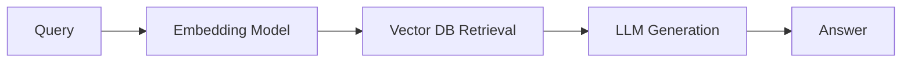

# RAG (Retrieval-Augmented Generation)

> Combines retrieval from a knowledge base with generation by a language model.

---

## What is it?

RAG pipelines first **retrieve relevant documents** and then **generate responses** using an LLM.

!!! tip
    Monitor query latency separately from generation latency — retrieval can become the bottleneck.

**Example:** Customer support bot retrieving FAQ docs and answering queries.

---

## Why Use It?

* Provides **factual grounding** for LLMs  
* Reduces hallucinations by injecting retrieved context  
* Scales well with **dynamic knowledge bases**

---

## Backend Considerations

| Aspect        | Recommendation                                |
| ------------- | --------------------------------------------- |
| Retrieval     | Use vector DB (Milvus, Qdrant) for embeddings |
| LLM           | Stream responses via vLLM                     |
| Caching       | Cache embeddings and query results            |
| Observability | Log retrieved docs, token usage, and latency  |

---

## Visual Diagram

