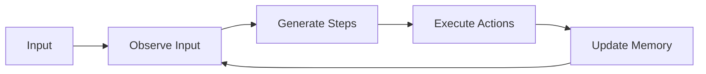
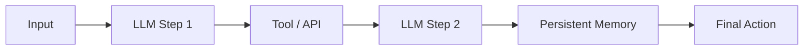

# Agentic Systems

> Autonomous reasoning using models, tools, and memory.

---

## What is it?

Agents combine **LLMs with tools and memory** to perform multi-step tasks.  
Each step may involve calling APIs, searching documents, or performing calculations.

!!! warning
    Never run agentic reasoning inside synchronous API threads — always offload to async workflows.

**Example:** Email assistant agent: reads, classifies, summarizes, and schedules emails.

---

## Why Use It?

* Automates **complex workflows**  
* Integrates multiple models and external tools  
* Supports **stateful reasoning** over multiple steps

---

## Loop Stages

> Observe → Plan → Act → Reflect

1. **Observe:** Gather input or state  
2. **Plan:** Generate reasoning steps or actions  
3. **Act:** Execute tools, queries, or APIs  
4. **Reflect:** Update memory, store outcomes  

---

## Backend Considerations

| Aspect        | Recommendation                                     |
| ------------- | -------------------------------------------------- |
| State         | External memory (Redis, PostgreSQL)                |
| Orchestration | Async workflows with retries and timeouts          |
| Scaling       | Each agent step may require GPU; consider batching |
| Observability | Structured logs per reasoning loop                 |

---

## Visual Diagram

