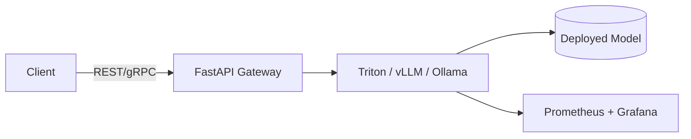

# Inference Servers

> Inference servers are **the runtime engines** that execute trained AI models efficiently and reliably in production.

---

## What They Do

An inference server:

* Loads one or more trained models into memory
* Exposes APIs (REST, gRPC, WebSocket) for prediction
* Handles batching, scheduling, and device placement (CPU/GPU)
* Monitors performance, memory, and throughput

!!! tip
    Think of inference servers as **“model web servers”** — instead of serving HTML, they serve predictions.

---

## Why You Need One

Running models directly inside your FastAPI app doesn’t scale.
Inference servers provide:

* **Isolation** between API logic and model execution
* **Performance optimizations** like batching and CUDA streams
* **Unified monitoring and scaling** (metrics, health checks, load balance)
* **Multi-model management** (hot reload, versioning)

---

## Common Production Stack

| Component                   | Purpose                                |
| --------------------------- | -------------------------------------- |
| **FastAPI / Flask**         | API gateway or orchestrator            |
| **Triton Inference Server** | Multi-framework, multi-model serving   |
| **vLLM / TGI / Ollama**     | Optimized for LLMs and token streaming |
| **Redis / Kafka**           | Queueing and caching layer             |
| **Prometheus / Grafana**    | Metrics and observability              |

---

## Architecture Overview

---

!!! warning "Backend Responsibility"
    Your API must **delegate heavy work** to inference servers, not handle it inline.
    Treat the inference layer like a microservice, not a Python import.

---

## Key Takeaway

Inference servers transform **trained models into scalable services.**.
They’re essential for real-world AI workloads where latency, memory, and reliability matter