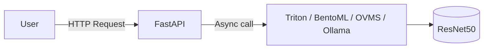

# Single-Model Servers

> The simplest deployment pattern: one model, one server, one task.

---

## When to Use

Ideal for:

* Lightweight use cases (e.g., image classification, sentiment analysis)
* Dedicated hardware (edge GPU, single container)
* Rapid prototyping or internal APIs

---

## Example Architecture

---

## Benefits

* Minimal complexity
* Predictable performance
* Easier debugging and resource allocation

## Drawbacks

* Wastes GPU if model idle
* Hard to scale multiple models
* No pipeline orchestration

---

### Backend Notes

* Use **async I/O** or **background tasks** to avoid blocking requests
* Run the model in a **dedicated process or container**
* Add **health probes** and **warmup hooks**

!!! tip "Recommended setup"
    - Triton Inference Server → best for GPU, ONNX, and TorchScript models
    - BentoML → for quick REST endpoints and CI/CD packaging
    - OVMS → for optimized CPU/edge inference
    - Ollama → for single LLM serving on local or GPU nodes