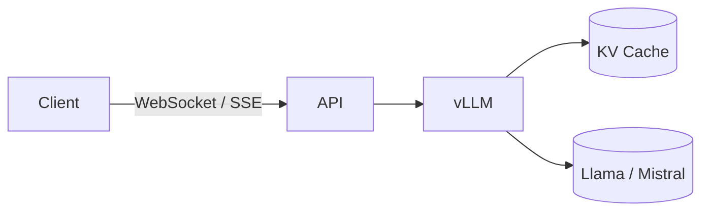

# LLM-Specific Servers

> Large Language Models require specialized runtimes for memory management, streaming, and caching.

---

## Why Regular Servers Fail

* Token-by-token generation requires **incremental decoding**
* 10–100× more VRAM than CV models
* Slow throughput for small batches
* Context window management and KV cache reuse

---

## Common Runtimes

| Runtime    | Strength                            | Notes                    |
| ---------- | ----------------------------------- | ------------------------ |
| **vLLM**   | Fastest decoding, OpenAI-like API   | Ideal for chatbots       |
| **TGI**    | HuggingFace official server         | Stable and feature-rich  |
| **Ollama** | Local, portable LLM runtime         | Great for on-prem setups |
| **SGLang** | Lightweight and streaming-optimized | Great for small setups   |

---

## Architecture Example

---

### Backend Considerations

* Use **Server-Sent Events (SSE)** or **WebSocket** for token streaming
* Offload session memory to **Redis / GPU KV cache**
* Handle cancellation, timeout, and partial output flush

!!! tip "Production Insight"
    LLM inference is **memory-bound**, not CPU-bound.
    Always monitor VRAM fragmentation and token throughput.