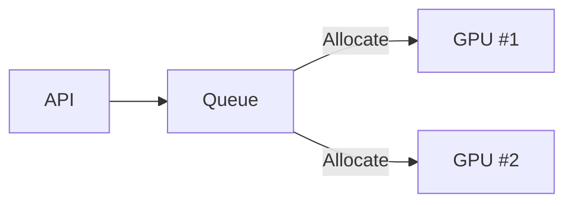

# Deployment & Scaling Patterns

> Efficient scaling determines your cost, latency, and uptime.

---

## Vertical vs Horizontal Scaling

| Type           | Strategy                  | Example                    |
| -------------- | ------------------------- | -------------------------- |
| **Vertical**   | Bigger GPUs (A100 → H100) | Better throughput per node |
| **Horizontal** | More replicas / pods      | Easier load balancing      |

!!! note
    Horizontal scaling is cheaper, but needs smart batching and autoscaling triggers.

---

## GPU Pooling

Run multiple models on one GPU pool and allocate on demand.
Used in **Triton**, **vLLM**, and **Ray Serve**.

---

## Autoscaling with KEDA

Scale replicas based on queue length or GPU utilization.
Zero-to-idle patterns save costs for LLMs.

!!! example "KEDA + Prometheus"
    - Trigger scale-up when queue > 50
    - Scale down after 30s idle

---

## Multi-GPU Scheduling

For large LLMs (70B+):

* Use **tensor parallelism** across GPUs
* Rely on NCCL / DeepSpeed / Megatron-LM for GPU communication