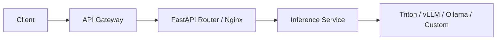
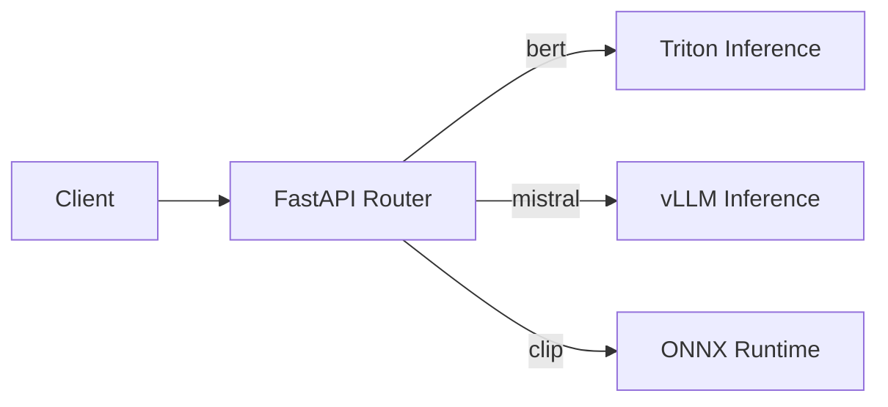
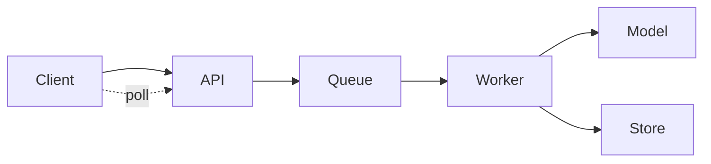

# API & Routing

> The API layer is the gateway to your models. Proper routing ensures predictable latency and GPU efficiency.

---

## Typical Layout



---

## Responsibilities

| Component             | Role                                          |
| --------------------- | --------------------------------------------- |
| **Gateway**           | Authentication, throttling, schema validation |
| **Router**            | Dispatches requests to correct model/version  |
| **Inference Service** | Normalizes input, manages batching            |
| **Runtime**           | Executes computation and returns predictions  |

---

## Multi-Model Routing

When you serve multiple models, each may have:

* Different **hardware requirements** (GPU vs CPU)
* Different **frameworks** (PyTorch, ONNX, vLLM)
* Different **latency and batching behavior**

Explicitly mapping endpoints to runtimes ensures:

* Efficient GPU allocation
* Independent scaling per model
* Clear logging and monitoring


Dynamic routing allows per-model scaling, logging, and monitoring.

```python
# Maps logical model names to runtime backends
ROUTING_TABLE = {
    "bert": "triton",
    "mistral": "vllm",
    "clip": "onnx",
}
```




---

## Async & Background Routing

For high-latency requests (large models, long pipelines), use a **queue-based async pattern**:



*This prevents blocking API workers and allows backpressure handling.*

---

## Bad vs Good Routing

**Bad:** `/predict` + JSON model field → hard to cache/log/scale

**Good:** `/v1/embedding/bert-base` → clear routing, logging, versioning

---

### Best Practices

!!! tip

    * Keep the routing table **in config**, not hard-coded
    * Log runtime selection for observability
    * Allow dynamic updates to add/remove models
    * Keep GPU allocation and batching separate per runtime

!!! warning

    * Don’t select runtime from request body → breaks caching and batching
    * Avoid routing multiple high-throughput models to the same GPU if they interfere

---

## Takeaway

> Routing is your first control layer. It manages **latency, isolation, and observability**.