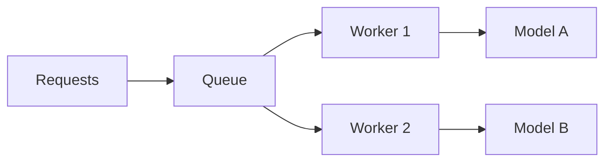

# Scaling & Load Management

> Scaling AI inference safely requires understanding model behavior, batch policy, and GPU constraints.

---

## Complexity Factors

- Model size (VRAM footprint)  
- Input size / token length  
- Batch policy (dynamic vs static)  
- GPU/CPU allocation per model  

---

## Scaling Strategies

| Strategy           | Description                             | Tools / Examples           |
| ------------------ | --------------------------------------- | -------------------------- |
| **Horizontal**     | Replicate inference pods per model      | K8s + HPA                  |
| **Model Sharding** | Split large models across multiple GPUs | DeepSpeed, Megatron        |
| **Queue-based**    | Scale based on request queue length     | KEDA, Redis Queue          |
| **Batching**       | Merge small requests for GPU efficiency | Triton, vLLM auto-batching |

---

## Queue-Based Load Pattern



*Requests enter a queue, workers pull tasks asynchronously, models execute independently.*

??? example "Python example"
    ```
    async def worker_loop(queue):
        while True:
            request = await queue.get()
            result = await route_request(request.model, request.payload)
            await store_result(request.id, result)
            queue.task_done()
    ```

---

### Anti-Patterns

!!! warning
    * Single queue for all models → GPU thrashing
    * Over-batching low-latency requests → increased P95 latency
    * Vertical scaling only → wasted resources and high cost


---

## Takeaway

> Scaling inference is **balance, not brute force**. Match model behavior with batch, queue, and replica strategy.