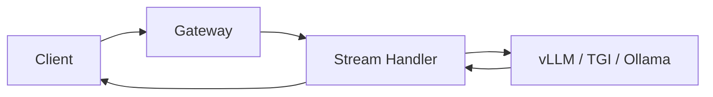

# Streaming & LLM Patterns

> Token streaming changes the classic “request → response” model, enabling interactive UX.

---

## Why Streaming

- Users expect immediate partial output  
- Reduces perceived latency  
- Essential for **chatbots, assistants, and long generation tasks**

---

## Streaming Protocols

| Protocol     | Pros                | Cons                      |
| ------------ | ------------------- | ------------------------- |
| SSE          | Lightweight, simple | One-way only              |
| WebSockets   | Bi-directional      | Infrastructure complexity |
| gRPC streams | High performance    | Harder to debug           |

---

## Backend Pattern



* Gateway normalizes requests
* Stream handler asynchronously reads token stream from runtime
* Client receives tokens progressively

??? example "Python example"
    ```python
    async def stream_response(model, prompt):
        async for token in model.generate_stream(prompt):
            yield f"data: {token}\n\n"
    ```

---

### Best Practices

!!! tip
    * Use async generators for token iteration
    * Include metadata + logs in stream
    * Handle client disconnects gracefully
    * Aggregate outputs for analytics

!!! warning
    * Don’t block API workers waiting for token generation
    * Avoid storing session data inside runtime — use external cache

---

## Takeaway

> Streaming improves responsiveness. Token-by-token output is core to modern LLM inference.