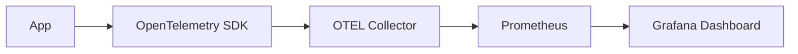

# Observability Integration

> You can’t improve what you don’t measure.

---

## Key Metrics

| Metric          | Meaning                 |
| --------------- | ----------------------- |
| Latency         | End-to-end request time |
| Throughput      | Requests/sec            |
| GPU Utilization | Hardware usage          |
| Error Rate      | Failed requests ratio   |
| Queue Depth     | Pending requests        |

---

## Architecture

---

### Best Practices

!!! tip
    * Use OpenTelemetry for distributed tracing
    * Tag metrics: `model_name`, `version`, `latency_class`
    * Expose **Prometheus metrics per pod**
    * Define **SLOs(Service-Level Objectives) per model**, not just per service

---

### Example SLOs

| Metric          | Target  |
| --------------- | ------- |
| P95 Latency     | < 500ms |
| Availability    | 99.9%   |
| GPU Utilization | 80–90%  |

### Logs & Tracing

* Trace each request from API → Runtime
* Include **runtime, GPU id, queue wait time**
* Persist errors with **request_id** for debugging

---

## Takeaway

> Observability is your early-warning system. Metrics, traces, and logs prevent surprises in production.
