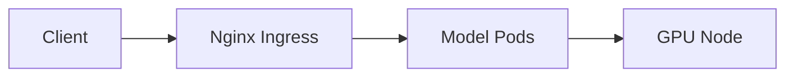

# Kubernetes & Helm

> Orchestrate replicas, scaling, and safe updates.

---

## Key Concepts

| Concept    | Purpose                                      |
| ---------- | -------------------------------------------- |
| Deployment | Runs multiple replicas per model             |
| Service    | Exposes endpoints (ClusterIP, LoadBalancer)  |
| Helm Chart | Templatizes deployment, config, and upgrades |

---

## Best Practices

- Pin GPU models to nodes with `nodeSelector`  
- Use **Horizontal Pod Autoscaler (HPA)** for dynamic scaling  
- Keep secrets/configs outside images (`ConfigMaps`, `Secrets`)  

---

## Architecture Flow



---

### Helm Values Example

```yaml
replicaCount: 2
resources:
  limits:
    nvidia.com/gpu: 1
nodeSelector:
  gpu: "true"
image:
  repository: mymodel
  tag: v1.2.0
```

---

### Tips & Warnings

!!! tip
    * Use **readiness/liveness probes** for model health
    * Monitor GPU utilization per pod

!!! warning
    * Don’t overcommit GPUs — can lead to OOM errors
    * Avoid running multiple large models on the same node unless tested