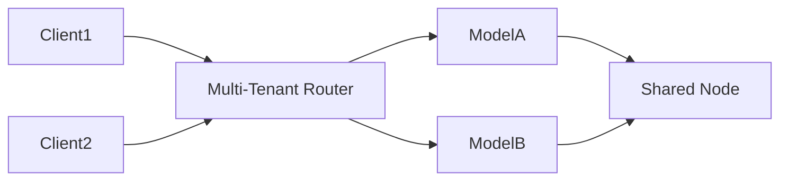

# Edge & Multi-Tenant Deployment

> Optimize AI workloads for latency and multiple clients.

---

## Edge Deployment

- Run **lightweight models** close to users  
- Techniques: quantization, pruning, memory profiling  
- Watch **latency, thermal limits, and resource usage**  

---

## Multi-Tenant Deployment

- Serve multiple customers on same hardware  
- Use **namespaces, resource quotas, and rate limits**  
- Isolate **data and model weights** per tenant  

---

## Architecture Flow

---

### Best Practices

!!! tip
    * Use separate **runtime instances per tenant** if workloads interfere
    * Monitor per-tenant metrics for fairness and SLA compliance

!!! warning
    * Don’t share sensitive data between tenants
    * Avoid running large LLMs on edge devices without profiling