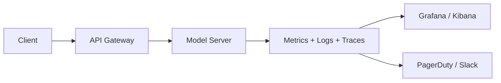

# Observability

> Make AI systems transparent, reliable, and manageable.

---

## Why Observability Matters

AI workloads are black boxes: models, GPUs, and async pipelines can fail silently.
Without observability, failures are detected too late, and debugging is costly.

Observability ensures you:

* Detect performance issues early  
* Track errors and failed predictions  
* Analyze usage patterns  
* Maintain system reliability under load  

---

## Core Pillars

1. **Metrics** — performance, throughput, GPU usage  
2. **Logging** — structured events, errors, and user interactions  
3. **Tracing** — distributed request paths, async pipelines, latency analysis  
4. **Alerts** — automated notifications for SLA breaches or OOMs  

---

## Architecture Overview

---

## Takeaway

> Observability is your **early warning system**. Without it, scaling and troubleshooting AI workloads is guesswork.