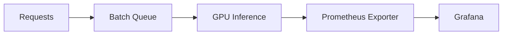

# Metrics

> Capture the right metrics to monitor performance and predict failures.

---

## Key Metrics

| Metric              | Purpose                                | Notes                          |
| ------------------- | -------------------------------------- | ------------------------------ |
| Request latency     | API responsiveness                     | Track P50, P95, P99            |
| Throughput          | Requests/sec or tokens/sec             | Useful for batching evaluation |
| GPU/CPU utilization | Detect bottlenecks or underutilization | Helps avoid overprovisioning   |
| Queue length        | Prevent saturation and OOM             | Identify backpressure          |
| Error rate          | Track failed requests                  | Combine with request type      |

---

## Best Practices

* Include **model name, version, endpoint** in metrics  
* Track **batch vs single request** latency  
* Use **Prometheus or OpenTelemetry** exporters  
* Combine with **alerts** for thresholds  

## Example Flow

*Tip:* Track **per-batch and per-token metrics** for LLMs to detect token-level bottlenecks.

---

## Takeaway

> Metrics provide **quantitative insight** into AI workloads and inform scaling and optimization decisions.