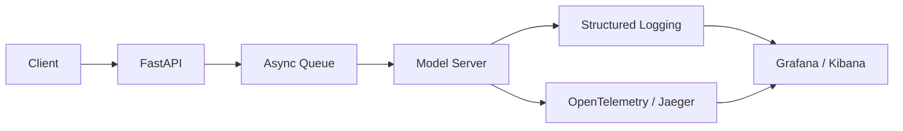

# Logging & Tracing

> Turn opaque AI pipelines into auditable and debuggable systems.

---

## Logging

* Structured JSON logs for easy querying  
* Include **request ID, model, version, user, latency**  
* Log **pipeline stages, retries, and partial outputs**  
* Capture **system warnings and OOM errors**

---

## Tracing

* Distributed tracing tracks requests across services  
* Useful for multi-stage pipelines, RAG, and async workflows  
* Tools: OpenTelemetry, Jaeger  
* Combine logs and traces for full observability

---

## Example Architecture

---

## Tips & Warnings

* Log **every inference step**, not just input/output
* Correlate **request IDs** across metrics, logs, and traces
* Avoid logging sensitive data in production

---

## Takeaway

> Logging + tracing = full transparency. They allow **proactive debugging, SLA verification, and usage analysis**.