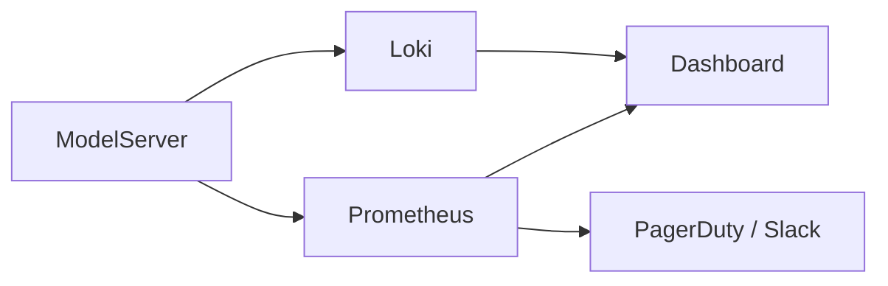

# Observability Tools

| Tool          | Purpose                  | Notes                                           |
| ------------- | ------------------------ | ----------------------------------------------- |
| Prometheus    | Metrics collection       | Use push/pull for batch and streaming workloads |
| Grafana       | Visualization dashboards | Create per-model dashboards                     |
| Loki          | Log aggregation          | Structured JSON logs, per-request correlation   |
| OpenTelemetry | Tracing & telemetry      | End-to-end request tracing                      |
| Sentry        | Exception monitoring     | Capture runtime errors and context              |

---

## Best Practices

* Centralize metrics, logs, and traces across services  
* Set **alerts for latency, GPU saturation, queue length, errors**  
* Tag by **model, version, endpoint, tenant**  
* Integrate **dashboards and automated reports**  

---

## Example Deployment Pattern

---

## Takeaway

> Observability tools let you **monitor, debug, and optimize** AI workloads in real time.
