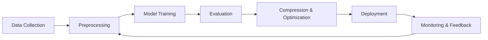
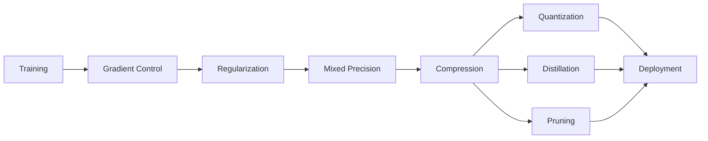
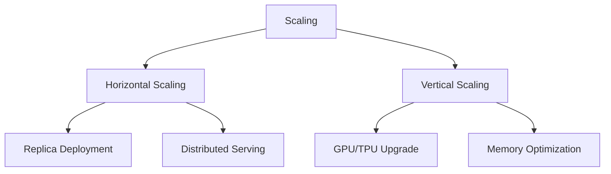
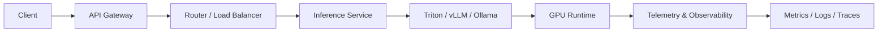
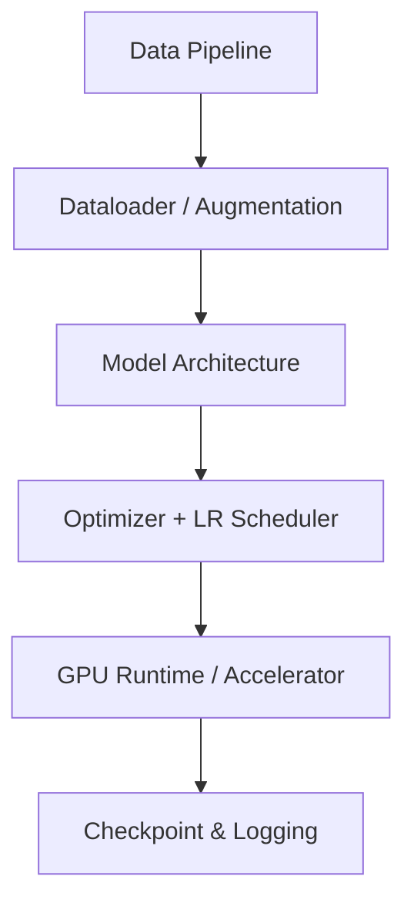
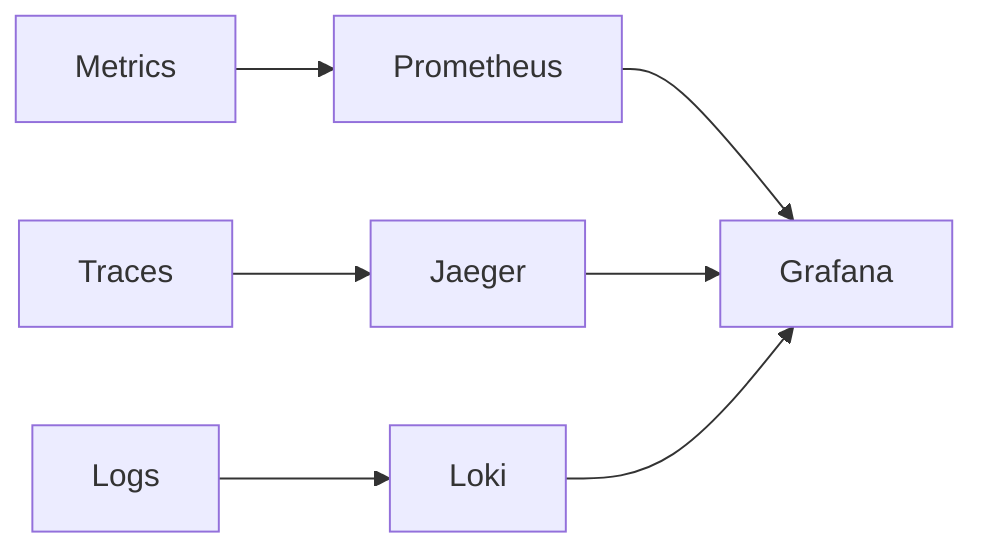
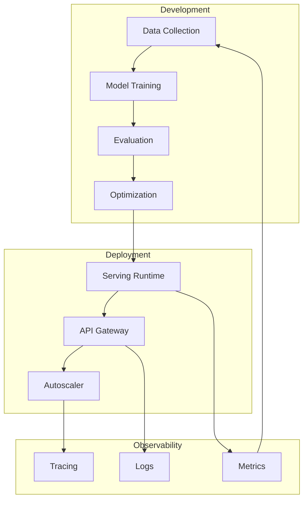

# AI Schema

> Concept maps connecting AI training, optimization, deployment, and serving.  
> Use this as a high-level guide for system architecture and learning flow.

---

## 1. AI Lifecycle Overview

*Feedback loops drive model iteration and continuous improvement.*

---

## 2. Model Optimization Path

**Goal:** Improve efficiency without sacrificing performance.

---

## 3. Scaling Hierarchy

**Horizontal = throughput**
**Vertical = capacity**

---

## 4. Inference Architecture Map

**Layers:**

* Gateway → Authentication & Throttling
* Router → Request dispatch & routing
* Runtime → Model execution backend
* Monitor → Metrics & feedback

---

## 5. Training Stack Abstraction

Each layer can be **profiled, optimized, or replaced** independently.

---

## 6. Observability Ecosystem

**Unified dashboards** give end-to-end visibility from model inference to user latency.

---

## 7. Complete AI System Map

