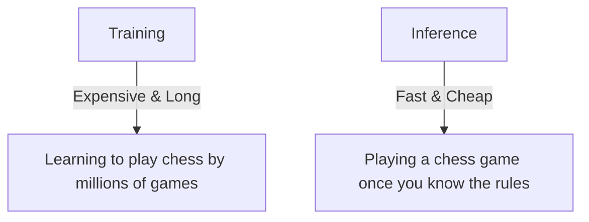

# Inference

## What is Inference?

Inference is the process of using a trained AI model to make predictions on new data.

!!! tip "Quick analogy"
    Think of inference as **making decisions** based on prior learned patterns, just like you make decisions based on your experiences.

**Under the hood**:

* A model file is loaded into memory
* Input data is fed into the model
* The model calculates an output (e.g., classifications, predictions, or generated text)

**Example**:
An image classifier can predict whether an image contains a cat or a dog in milliseconds to seconds.

---

## Inference vs. Training

Before deployment, it's important to understand the differences between inference and training for a model:

=== "Training"

    The process of teaching a model by showing it examples and adjusting its internal numbers (weights) to minimize errors.

    **What happens**:

    1. Input data → model predicts
    2. Compare with ground truth (loss)
    3. Adjust weights (backpropagation)
    4. Repeat millions of times

    **Computational requirements**:

    * **Very intensive**: Needs powerful GPUs or TPUs
    * **Memory hungry**: Stores gradients, optimizer states, and batch data
    * **Time-consuming**: Can take hours, days, or weeks 
    * **Resource example**: Training GPT-3 cost ~$4-5 million in compute

    !!! warning "Resource-intensive"
        * Needs powerful GPUs/TPUs
        * Large memory (gradients, optimizers, batches)
        * Training GPT-3 ≈ **$4–5M in compute**

    !!! info "Typical hardware"
        * GPU: 16–80GB VRAM (NVIDIA A100, H100)
        * RAM: 32–256GB
        * Storage: NVMe SSD

    !!! tip "Who does this?"
        Training is usually handled by ML engineers / data scientists, not backend developers.

=== "Inference"

    Using a trained model to make predictions on new data.

    **What happens**:

    1. Load the pre-trained model once (at startup)
    2. Receive input data (e.g., an image from a user)
    3. Run it through the model (forward pass only)
    4. Return the prediction

    **Computational requirements**:

    * **Much lighter**: Can run on CPUs, modest GPUs, or even mobile devices
    * **Memory efficient**: Only needs to store model weights
    * **Fast**: Milliseconds to seconds per prediction
    * **Scalable**: Can handle thousands of requests per second

    !!! note "Efficient by design"
        * Can run on CPUs, modest GPUs, or even mobile devices
        * Lightweight memory usage (model weights only)
        * Scales to thousands of requests/second

    !!! info "Typical hardware"
        * CPU: 4-16 cores (for small models)
        * GPU: Optional but faster (8-16GB VRAM)
        * RAM: 2-4× the model size
        * Example: 2GB model needs ~4-8GB RAM

    !!! tip "Your role as backend engineer"
        This is what you deploy in production.

## Visual Analogy

