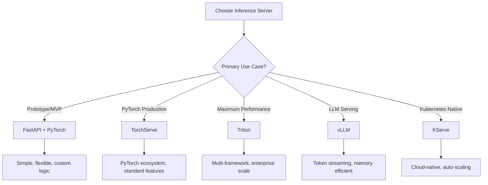

# Inference Servers

Inference servers abstract infrastructure complexity, providing scalable model hosting with features like batching, monitoring, multi-model serving, and GPU optimization.

## 🎯 Server Comparison Matrix

| Server                | Frameworks      | GPU Batching | Multi-Model | Complexity | Production Ready | Best For                     |
| --------------------- | --------------- | ------------ | ----------- | ---------- | ---------------- | ---------------------------- |
| **FastAPI + PyTorch** | PyTorch         | Manual       | Manual      | Low        | ⭐⭐⭐              | Prototyping, simple APIs     |
| **TorchServe**        | PyTorch         | ✅            | ✅           | Medium     | ⭐⭐⭐⭐             | PyTorch production           |
| **Triton**            | Multi-framework | ✅            | ✅           | High       | ⭐⭐⭐⭐⭐            | Enterprise, high performance |
| **vLLM**              | LLMs only       | ✅            | ✅           | Medium     | ⭐⭐⭐⭐             | LLM serving, streaming       |
| **KServe**            | Multi-framework | ✅            | ✅           | High       | ⭐⭐⭐⭐             | Kubernetes-native            |
| **BentoML**           | Multi-framework | Partial      | ✅           | Medium     | ⭐⭐⭐              | MLOps, rapid deployment      |

## 🚀 FastAPI + PyTorch (Baseline)

### When to Use
- **Prototyping and MVP** development
- **Simple models** with straightforward inference
- **Custom preprocessing/postprocessing** requirements
- **Full control** over serving logic

### Technical Implementation

**Complete Production-Ready FastAPI Server:**
```python
from fastapi import FastAPI, HTTPException, BackgroundTasks
from fastapi.middleware.cors import CORSMiddleware
from fastapi.middleware.gzip import GZipMiddleware
import torch
import torch.nn.functional as F
from torch.utils.data import DataLoader
import asyncio
import time
import logging
from contextlib import asynccontextmanager
from prometheus_client import Counter, Histogram, Gauge, generate_latest
import psutil
import GPUtil

# Global variables for model and metrics
model = None
device = None

# Prometheus metrics
REQUEST_COUNT = Counter('inference_requests_total', 'Total requests', ['model', 'status'])
REQUEST_LATENCY = Histogram('inference_duration_seconds', 'Request latency', ['model'])
ACTIVE_REQUESTS = Gauge('active_requests', 'Currently active requests')
GPU_UTILIZATION = Gauge('gpu_utilization_percent', 'GPU utilization')
GPU_MEMORY = Gauge('gpu_memory_usage_bytes', 'GPU memory usage')
CPU_USAGE = Gauge('cpu_usage_percent', 'CPU usage')
MEMORY_USAGE = Gauge('memory_usage_bytes', 'RAM usage')

class ModelManager:
    def __init__(self):
        self.models = {}
        self.device = torch.device("cuda" if torch.cuda.is_available() else "cpu")
        self.batch_size = 8
        self.max_batch_delay = 0.1  # 100ms max batching delay
        self.pending_requests = []
        self.batch_lock = asyncio.Lock()
        
    async def load_model(self, model_name: str, model_path: str):
        """Load model with proper error handling"""
        try:
            if model_name in self.models:
                logging.info(f"Model {model_name} already loaded")
                return
                
            # Load model
            model = torch.jit.load(model_path, map_location=self.device)
            model.eval()
            
            # Warmup
            dummy_input = torch.randn(1, 3, 224, 224).to(self.device)
            with torch.no_grad():
                _ = model(dummy_input)
            
            self.models[model_name] = model
            logging.info(f"Successfully loaded model {model_name}")
            
        except Exception as e:
            logging.error(f"Failed to load model {model_name}: {str(e)}")
            raise
    
    async def predict_batch(self, requests: list):
        """Batch inference with error handling"""
        if not requests:
            return []
        
        model_name = requests[0]['model_name']
        if model_name not in self.models:
            raise HTTPException(status_code=404, detail=f"Model {model_name} not found")
        
        model = self.models[model_name]
        
        try:
            # Prepare batch
            batch_tensors = []
            for req in requests:
                tensor = preprocess_image(req['image_data'])
                batch_tensors.append(tensor)
            
            batch_input = torch.stack(batch_tensors).to(self.device)
            
            # Inference
            start_time = time.time()
            with torch.no_grad():
                batch_outputs = model(batch_input)
            
            inference_time = time.time() - start_time
            
            # Process results
            results = []
            for i, req in enumerate(requests):
                output = batch_outputs[i]
                predictions = postprocess_output(output, req.get('confidence_threshold', 0.5))
                
                results.append({
                    'request_id': req['request_id'],
                    'predictions': predictions,
                    'processing_time_ms': inference_time * 1000 / len(requests),
                    'batch_size': len(requests)
                })
            
            return results
            
        except Exception as e:
            logging.error(f"Batch inference failed: {str(e)}")
            # Return errors for all requests in batch
            return [{'request_id': req['request_id'], 'error': str(e)} for req in requests]

model_manager = ModelManager()

@asynccontextmanager
async def lifespan(app: FastAPI):
    # Startup
    global model, device
    logging.info("Starting up inference server...")
    
    # Load models
    await model_manager.load_model("yolov8n", "/models/yolov8n.torchscript.pt")
    await model_manager.load_model("resnet50", "/models/resnet50.torchscript.pt")
    
    # Start monitoring task
    asyncio.create_task(update_system_metrics())
    
    yield
    
    # Shutdown
    logging.info("Shutting down inference server...")

app = FastAPI(
    title="AI Inference Server",
    description="Production-ready AI inference with batching and monitoring",
    version="1.0.0",
    lifespan=lifespan
)

# Middleware
app.add_middleware(GZipMiddleware, minimum_size=1000)
app.add_middleware(
    CORSMiddleware,
    allow_origins=["*"],
    allow_credentials=True,
    allow_methods=["*"],
    allow_headers=["*"],
)

class BatchRequest:
    def __init__(self, request_id: str, model_name: str, image_data: str, 
                 confidence_threshold: float, future: asyncio.Future):
        self.request_id = request_id
        self.model_name = model_name
        self.image_data = image_data
        self.confidence_threshold = confidence_threshold
        self.future = future
        self.timestamp = time.time()

@app.post("/predict")
async def predict(
    model_name: str,
    image_data: str,
    confidence_threshold: float = 0.5,
    request_id: str = None
):
    """Single prediction with optional batching"""
    if request_id is None:
        request_id = f"req_{int(time.time() * 1000)}"
    
    ACTIVE_REQUESTS.inc()
    start_time = time.time()
    
    try:
        # Create future for result
        result_future = asyncio.Future()
        
        # Add to batch queue
        batch_request = BatchRequest(
            request_id, model_name, image_data, 
            confidence_threshold, result_future
        )
        
        async with model_manager.batch_lock:
            model_manager.pending_requests.append(batch_request)
            
            # Process batch if conditions met
            if (len(model_manager.pending_requests) >= model_manager.batch_size or
                time.time() - model_manager.pending_requests[0].timestamp > model_manager.max_batch_delay):
                
                await process_batch()
        
        # Wait for result
        result = await result_future
        
        # Record metrics
        REQUEST_LATENCY.labels(model=model_name).observe(time.time() - start_time)
        REQUEST_COUNT.labels(model=model_name, status='success').inc()
        
        return result
        
    except Exception as e:
        REQUEST_COUNT.labels(model=model_name, status='error').inc()
        raise HTTPException(status_code=500, detail=str(e))
    
    finally:
        ACTIVE_REQUESTS.dec()

async def process_batch():
    """Process current batch of requests"""
    if not model_manager.pending_requests:
        return
    
    current_batch = model_manager.pending_requests.copy()
    model_manager.pending_requests.clear()
    
    # Group by model
    model_batches = {}
    for req in current_batch:
        if req.model_name not in model_batches:
            model_batches[req.model_name] = []
        model_batches[req.model_name].append({
            'request_id': req.request_id,
            'model_name': req.model_name,
            'image_data': req.image_data,
            'confidence_threshold': req.confidence_threshold
        })
    
    # Process each model batch
    for model_name, requests in model_batches.items():
        try:
            results = await model_manager.predict_batch(requests)
            
            # Set results for futures
            for i, req in enumerate(current_batch):
                if req.model_name == model_name:
                    if not req.future.done():
                        req.future.set_result(results[i])
                        
        except Exception as e:
            # Set error for all requests in this model batch
            for req in current_batch:
                if req.model_name == model_name and not req.future.done():
                    req.future.set_exception(HTTPException(status_code=500, detail=str(e)))

@app.get("/health")
async def health_check():
    """Comprehensive health check"""
    health_status = {
        "status": "healthy",
        "timestamp": time.time(),
        "models_loaded": list(model_manager.models.keys()),
        "device": str(model_manager.device),
        "active_requests": ACTIVE_REQUESTS._value.get(),
        "system": {
            "cpu_percent": psutil.cpu_percent(),
            "memory_percent": psutil.virtual_memory().percent,
            "disk_percent": psutil.disk_usage('/').percent
        }
    }
    
    # GPU info if available
    if torch.cuda.is_available():
        try:
            gpus = GPUtil.getGPUs()
            if gpus:
                gpu = gpus[0]
                health_status["gpu"] = {
                    "name": gpu.name,
                    "utilization": gpu.load * 100,
                    "memory_used": gpu.memoryUsed,
                    "memory_total": gpu.memoryTotal,
                    "temperature": gpu.temperature
                }
        except:
            pass
    
    return health_status

@app.get("/metrics")
async def metrics():
    """Prometheus metrics endpoint"""
    return Response(generate_latest(), media_type="text/plain")

async def update_system_metrics():
    """Background task to update system metrics"""
    while True:
        try:
            # CPU and Memory
            CPU_USAGE.set(psutil.cpu_percent())
            MEMORY_USAGE.set(psutil.virtual_memory().used)
            
            # GPU metrics
            if torch.cuda.is_available():
                try:
                    gpus = GPUtil.getGPUs()
                    if gpus:
                        gpu = gpus[0]
                        GPU_UTILIZATION.set(gpu.load * 100)
                        GPU_MEMORY.set(gpu.memoryUsed * 1024 * 1024)  # Convert to bytes
                except:
                    pass
            
            await asyncio.sleep(10)  # Update every 10 seconds
            
        except Exception as e:
            logging.error(f"Error updating metrics: {e}")
            await asyncio.sleep(10)

# Background task for batch processing
@app.on_event("startup")
async def start_batch_processor():
    asyncio.create_task(batch_processor_loop())

async def batch_processor_loop():
    """Continuous batch processing loop"""
    while True:
        try:
            await asyncio.sleep(0.01)  # Check every 10ms
            
            async with model_manager.batch_lock:
                if model_manager.pending_requests:
                    oldest_request = model_manager.pending_requests[0]
                    age = time.time() - oldest_request.timestamp
                    
                    if age > model_manager.max_batch_delay:
                        await process_batch()
                        
        except Exception as e:
            logging.error(f"Batch processor error: {e}")
            await asyncio.sleep(1)
```

**Docker Configuration:**
```dockerfile
FROM python:3.11-slim

# Install system dependencies
RUN apt-get update && apt-get install -y \
    build-essential \
    curl \
    && rm -rf /var/lib/apt/lists/*

WORKDIR /app

# Install Python dependencies
COPY requirements.txt .
RUN pip install --no-cache-dir -r requirements.txt

# Copy application
COPY . .

# Create models directory
RUN mkdir -p /models

# Expose ports
EXPOSE 8000

# Health check
HEALTHCHECK --interval=30s --timeout=30s --start-period=5s --retries=3 \
    CMD curl -f http://localhost:8000/health || exit 1

CMD ["uvicorn", "main:app", "--host", "0.0.0.0", "--port", "8000", "--workers", "1"]
```

### Performance Characteristics
- **Startup Time**: <5 seconds
- **Memory Overhead**: 100-300MB (depending on model size)  
- **GPU Utilization**: 60-75% (with manual batching)
- **Throughput**: 100-1,000 RPS (model dependent)
- **Latency**: 10-100ms (plus model inference time)

## ⚡ TorchServe

### When to Use TorchServe
- **PyTorch models in production** with minimal code changes
- **Built-in features** like batching, monitoring, and A/B testing
- **Model archiving** and versioning requirements  
- **Standard deployment** without complex customization

### Technical Implementation

**Model Archive Creation:**
```bash
# Create model archive (.mar file)
torch-model-archiver \
    --model-name yolov8_detector \
    --version 1.0 \
    --serialized-file model.pt \
    --handler custom_handler.py \
    --extra-files index_to_name.json,config.yaml \
    --export-path model_store/ \
    --archive-format default
```

**Custom Handler:**
```python
import torch
import torchvision.transforms as transforms
from torchvision import models
from ts.torch_handler.base_handler import BaseHandler
import io
import json
import logging
import base64
from PIL import Image
import numpy as np

logger = logging.getLogger(__name__)

class YOLOv8Handler(BaseHandler):
    """Custom handler for YOLOv8 object detection"""
    
    def __init__(self):
        super().__init__()
        self.transform = None
        self.class_names = None
        self.confidence_threshold = 0.25
        self.iou_threshold = 0.45
    
    def initialize(self, context):
        """Initialize model and preprocessing"""
        properties = context.system_properties
        self.device = torch.device(
            "cuda:" + str(properties.get("gpu_id")) 
            if torch.cuda.is_available() and properties.get("gpu_id") is not None 
            else "cpu"
        )
        
        # Load model
        self.model = torch.jit.load(
            context.manifest["model"]["serializedFile"], 
            map_location=self.device
        )
        self.model.eval()
        
        # Load class names
        with open("index_to_name.json", 'r') as f:
            self.class_names = json.load(f)
        
        # Define transforms
        self.transform = transforms.Compose([
            transforms.Resize((640, 640)),
            transforms.ToTensor(),
        ])
        
        logger.info(f"YOLOv8 model loaded successfully on {self.device}")
    
    def preprocess(self, data):
        """Preprocess input data"""
        images = []
        
        for row in data:
            try:
                # Handle different input formats
                if "body" in row:
                    body = row["body"]
                    if isinstance(body, dict):
                        if "image" in body:
                            image_data = body["image"]
                        else:
                            image_data = body
                    else:
                        image_data = body
                else:
                    image_data = row.get("data") or row
                
                # Decode base64 if needed
                if isinstance(image_data, str):
                    if image_data.startswith('data:image'):
                        image_data = image_data.split(',')[1]
                    image_bytes = base64.b64decode(image_data)
                    image = Image.open(io.BytesIO(image_bytes)).convert("RGB")
                else:
                    image = Image.open(io.BytesIO(image_data)).convert("RGB")
                
                # Apply transforms
                image_tensor = self.transform(image)
                images.append(image_tensor)
                
            except Exception as e:
                logger.error(f"Error preprocessing image: {str(e)}")
                raise ValueError(f"Invalid image data: {str(e)}")
        
        return torch.stack(images).to(self.device)
    
    def inference(self, data):
        """Run model inference"""
        try:
            with torch.no_grad():
                results = self.model(data)
            return results
        except Exception as e:
            logger.error(f"Inference error: {str(e)}")
            raise RuntimeError(f"Model inference failed: {str(e)}")
    
    def postprocess(self, data):
        """Postprocess model outputs"""
        outputs = []
        
        for i, result in enumerate(data):
            try:
                # YOLOv8 output format: [batch, boxes, 4+num_classes]
                # boxes format: [x1, y1, x2, y2, conf, class_id]
                
                detections = []
                if hasattr(result, 'boxes') and result.boxes is not None:
                    boxes = result.boxes.xyxy.cpu().numpy()  # x1,y1,x2,y2
                    scores = result.boxes.conf.cpu().numpy()  # confidence
                    classes = result.boxes.cls.cpu().numpy().astype(int)  # class ids
                    
                    for box, score, cls_id in zip(boxes, scores, classes):
                        if score >= self.confidence_threshold:
                            detection = {
                                "bbox": {
                                    "x1": float(box[0]),
                                    "y1": float(box[1]), 
                                    "x2": float(box[2]),
                                    "y2": float(box[3])
                                },
                                "confidence": float(score),
                                "class_id": int(cls_id),
                                "class_name": self.class_names.get(str(cls_id), f"class_{cls_id}")
                            }
                            detections.append(detection)
                
                output = {
                    "detections": detections,
                    "num_detections": len(detections),
                    "image_id": i
                }
                outputs.append(output)
                
            except Exception as e:
                logger.error(f"Postprocessing error for image {i}: {str(e)}")
                outputs.append({
                    "error": str(e),
                    "detections": [],
                    "num_detections": 0,
                    "image_id": i
                })
        
        return outputs
```

**Configuration (config.properties):**
```properties
# Inference configuration
inference_address=http://0.0.0.0:8080
management_address=http://0.0.0.0:8081
metrics_address=http://0.0.0.0:8082

# Model store
model_store=/opt/ml/model

# Performance settings
default_workers_per_model=2
max_workers=8
job_queue_size=1000
max_response_size=6553500
default_response_timeout=120

# Batching configuration  
batch_size=8
max_batch_delay=100

# Logging
default_response_timeout=300
unregister_model_timeout=120
decode_input_request=true
install_py_dep_per_model=true

# Enable metrics
enable_envvars_config=true
enable_metrics_api=true
metrics_format=prometheus
```

**Deployment:**
```bash
# Start TorchServe
torchserve \
    --start \
    --model-store model_store \
    --models yolov8=yolov8_detector.mar \
    --ts-config config.properties \
    --ncs

# Load additional models
curl -X POST "http://localhost:8081/models?model_name=resnet50&url=resnet50.mar&initial_workers=2&synchronous=true"

# Scale workers
curl -X PUT "http://localhost:8081/models/yolov8?min_worker=1&max_worker=4"

# Get model info
curl http://localhost:8081/models/yolov8
```

**Docker Compose:**
```yaml
version: '3.8'
services:
  torchserve:
    image: pytorch/torchserve:latest-gpu
    ports:
      - "8080:8080"  # Inference API
      - "8081:8081"  # Management API  
      - "8082:8082"  # Metrics API
    volumes:
      - ./model_store:/home/model-server/model-store
      - ./config.properties:/home/model-server/config.properties
    environment:
      - CUDA_VISIBLE_DEVICES=0
    deploy:
      resources:
        reservations:
          devices:
            - driver: nvidia
              count: 1
              capabilities: [gpu]
```

### Performance Characteristics
- **Startup Time**: 10-30 seconds (model loading)
- **Memory Overhead**: 200-800MB base + model size
- **GPU Utilization**: 70-85% (with dynamic batching)
- **Throughput**: 500-5,000 RPS (model dependent)
- **Latency**: 5-50ms + model inference time

## 🏢 Triton Inference Server

### When to Use Triton
- **Multi-framework deployment** (TensorFlow, PyTorch, ONNX)
- **Maximum performance** and GPU utilization required
- **Enterprise features** like model versioning and A/B testing
- **Complex serving pipelines** with ensembles

### Technical Implementation

**Model Repository Structure:**
```
model_repository/
├── yolov8_pytorch/
│   ├── config.pbtxt
│   └── 1/
│       └── model.pt
├── yolov8_onnx/
│   ├── config.pbtxt
│   └── 1/
│       └── model.onnx
└── ensemble_detector/
    ├── config.pbtxt
    └── 1/
```

**Model Configuration (config.pbtxt):**
```protobuf
name: "yolov8_pytorch"
platform: "pytorch_libtorch"
max_batch_size: 16
input [
  {
    name: "INPUT__0"
    data_type: TYPE_FP32
    format: FORMAT_NCHW
    dims: [ 3, 640, 640 ]
  }
]
output [
  {
    name: "OUTPUT__0"
    data_type: TYPE_FP32
    dims: [ -1, 6 ]  # Dynamic output size
  }
]

# Dynamic batching configuration
dynamic_batching {
  preferred_batch_size: [ 4, 8 ]
  max_queue_delay_microseconds: 100000  # 100ms
}

# Instance groups for multiple GPUs
instance_group [
  {
    count: 2
    kind: KIND_GPU
    gpus: [ 0, 1 ]
  }
]

# Optimization
optimization {
  cuda {
    graphs: true
    busy_wait_events: true
  }
}

# Model warmup
model_warmup [
  {
    name: "sample_request"
    batch_size: 1
    inputs {
      key: "INPUT__0"
      value: {
        data_type: TYPE_FP32
        dims: [ 3, 640, 640 ]
        zero_data: true
      }
    }
  }
]
```

**Ensemble Model Configuration:**
```protobuf
name: "ensemble_detector"
platform: "ensemble"
max_batch_size: 16

input [
  {
    name: "IMAGE"
    data_type: TYPE_UINT8
    dims: [ -1, -1, 3 ]
  }
]

output [
  {
    name: "DETECTIONS"
    data_type: TYPE_FP32
    dims: [ -1, 6 ]
  }
]

ensemble_scheduling {
  step [
    {
      model_name: "preprocessing"
      model_version: -1
      input_map {
        key: "raw_image"
        value: "IMAGE"
      }
      output_map {
        key: "processed_image"
        value: "preprocessed"
      }
    },
    {
      model_name: "yolov8_pytorch"
      model_version: -1
      input_map {
        key: "INPUT__0" 
        value: "preprocessed"
      }
      output_map {
        key: "OUTPUT__0"
        value: "raw_detections"
      }
    },
    {
      model_name: "postprocessing"
      model_version: -1
      input_map {
        key: "detections"
        value: "raw_detections"
      }
      output_map {
        key: "final_detections"
        value: "DETECTIONS"
      }
    }
  ]
}
```

**Python Client:**
```python
import tritonclient.http as httpclient
import tritonclient.grpc as grpcclient
import numpy as np
from PIL import Image
import cv2

class TritonClient:
    def __init__(self, url: str, protocol: str = "http"):
        if protocol == "http":
            self.client = httpclient.InferenceServerClient(url=url)
        elif protocol == "grpc":
            self.client = grpcclient.InferenceServerClient(url=url)
        else:
            raise ValueError("Protocol must be 'http' or 'grpc'")
        
        self.protocol = protocol
    
    def is_server_ready(self):
        return self.client.is_server_ready()
    
    def get_model_metadata(self, model_name: str):
        return self.client.get_model_metadata(model_name)
    
    def infer(self, model_name: str, inputs: dict, outputs: list = None):
        """Generic inference method"""
        # Prepare inputs
        triton_inputs = []
        for name, data in inputs.items():
            if self.protocol == "http":
                input_obj = httpclient.InferInput(name, data.shape, "FP32")
            else:
                input_obj = grpcclient.InferInput(name, data.shape, "FP32")
            
            input_obj.set_data_from_numpy(data)
            triton_inputs.append(input_obj)
        
        # Prepare outputs (if specified)
        triton_outputs = []
        if outputs:
            for output_name in outputs:
                if self.protocol == "http":
                    output_obj = httpclient.InferRequestedOutput(output_name)
                else:
                    output_obj = grpcclient.InferRequestedOutput(output_name)
                triton_outputs.append(output_obj)
        
        # Run inference
        results = self.client.infer(
            model_name=model_name,
            inputs=triton_inputs,
            outputs=triton_outputs or None
        )
        
        return results
    
    def predict_yolo(self, image: np.ndarray, model_name: str = "yolov8_pytorch"):
        """Specialized method for YOLO inference"""
        # Preprocess
        image_resized = cv2.resize(image, (640, 640))
        image_normalized = image_resized.astype(np.float32) / 255.0
        image_transposed = np.transpose(image_normalized, (2, 0, 1))
        image_batch = np.expand_dims(image_transposed, axis=0)
        
        # Inference
        inputs = {"INPUT__0": image_batch}
        results = self.infer(model_name, inputs, ["OUTPUT__0"])
        
        # Extract results
        detections = results.as_numpy("OUTPUT__0")
        return self.postprocess_yolo(detections[0], image.shape)
    
    def postprocess_yolo(self, detections: np.ndarray, original_shape: tuple):
        """Postprocess YOLO detections"""
        boxes = []
        confidences = []
        class_ids = []
        
        for detection in detections:
            x1, y1, x2, y2, conf, class_id = detection
            
            if conf > 0.5:  # Confidence threshold
                # Scale back to original image size
                scale_x = original_shape[1] / 640
                scale_y = original_shape[0] / 640
                
                x1_scaled = int(x1 * scale_x)
                y1_scaled = int(y1 * scale_y)
                x2_scaled = int(x2 * scale_x)
                y2_scaled = int(y2 * scale_y)
                
                boxes.append([x1_scaled, y1_scaled, x2_scaled, y2_scaled])
                confidences.append(float(conf))
                class_ids.append(int(class_id))
        
        return {
            "boxes": boxes,
            "confidences": confidences,
            "class_ids": class_ids
        }

# Usage example
client = TritonClient("localhost:8000", protocol="http")

# Check server status
print("Server ready:", client.is_server_ready())

# Load image
image = cv2.imread("test_image.jpg")

# Run inference
results = client.predict_yolo(image)
print(f"Found {len(results['boxes'])} detections")
```

**Kubernetes Deployment:**
```yaml
apiVersion: apps/v1
kind: Deployment
metadata:
  name: triton-server
spec:
  replicas: 2
  selector:
    matchLabels:
      app: triton-server
  template:
    metadata:
      labels:
        app: triton-server
    spec:
      containers:
      - name: triton
        image: nvcr.io/nvidia/tritonserver:23.10-py3
        args:
          - tritonserver
          - --model-repository=/models
          - --strict-model-config=false
          - --log-verbose=1
        ports:
        - containerPort: 8000  # HTTP
        - containerPort: 8001  # gRPC
        - containerPort: 8002  # Metrics
        volumeMounts:
        - name: model-repository
          mountPath: /models
        resources:
          requests:
            nvidia.com/gpu: 1
            memory: "4Gi"
            cpu: "2"
          limits:
            nvidia.com/gpu: 1
            memory: "8Gi"
            cpu: "4"
        readinessProbe:
          httpGet:
            path: /v2/health/ready
            port: 8000
          initialDelaySeconds: 10
          periodSeconds: 5
        livenessProbe:
          httpGet:
            path: /v2/health/live
            port: 8000
          initialDelaySeconds: 30
          periodSeconds: 10
      volumes:
      - name: model-repository
        persistentVolumeClaim:
          claimName: triton-models-pvc

---
apiVersion: v1
kind: Service
metadata:
  name: triton-service
spec:
  selector:
    app: triton-server
  ports:
  - name: http
    protocol: TCP
    port: 8000
    targetPort: 8000
  - name: grpc
    protocol: TCP
    port: 8001
    targetPort: 8001
  - name: metrics
    protocol: TCP
    port: 8002
    targetPort: 8002
  type: LoadBalancer
```

### Performance Characteristics
- **Startup Time**: 15-60 seconds (model loading + optimization)
- **Memory Overhead**: 500MB-2GB (depending on models and optimization)
- **GPU Utilization**: 85-95% (with dynamic batching and CUDA graphs)
- **Throughput**: 2,000-20,000 RPS (depending on model and hardware)
- **Latency**: 2-20ms + model inference time

## 🤖 vLLM

### When to Use vLLM
- **Large Language Model serving** (7B+ parameters)
- **Token streaming** for chat applications
- **Memory-efficient serving** of transformer models
- **High-throughput LLM inference**

### Technical Implementation

**Basic vLLM Server:**
```python
from vllm import LLM, SamplingParams
from vllm.engine.arg_utils import AsyncEngineArgs
from vllm.engine.async_llm_engine import AsyncLLMEngine
from fastapi import FastAPI, HTTPException
from fastapi.responses import StreamingResponse
import asyncio
import json
import time
import uuid
from typing import AsyncGenerator, List, Optional

app = FastAPI(title="vLLM Inference Server")

class vLLMServer:
    def __init__(self, model_name: str, tensor_parallel_size: int = 1):
        self.model_name = model_name
        
        # Configure engine
        engine_args = AsyncEngineArgs(
            model=model_name,
            tensor_parallel_size=tensor_parallel_size,
            dtype="float16",  # Use FP16 for memory efficiency
            max_model_len=4096,  # Adjust based on model capabilities
            gpu_memory_utilization=0.9,
            enforce_eager=False,  # Use CUDA graphs when possible
            disable_log_stats=False
        )
        
        self.engine = AsyncLLMEngine.from_engine_args(engine_args)
        
    async def generate(
        self,
        prompt: str,
        max_tokens: int = 512,
        temperature: float = 0.7,
        top_p: float = 0.9,
        stream: bool = False,
        request_id: str = None
    ):
        """Generate text with optional streaming"""
        
        if request_id is None:
            request_id = str(uuid.uuid4())
        
        sampling_params = SamplingParams(
            temperature=temperature,
            top_p=top_p,
            max_tokens=max_tokens,
            stop=["</s>", "<|endoftext|>"]
        )
        
        if stream:
            return self._stream_generate(prompt, sampling_params, request_id)
        else:
            return await self._batch_generate(prompt, sampling_params, request_id)
    
    async def _batch_generate(self, prompt: str, sampling_params: SamplingParams, request_id: str):
        """Non-streaming generation"""
        start_time = time.time()
        
        # Add request to engine
        results_generator = self.engine.generate(prompt, sampling_params, request_id)
        
        # Wait for completion
        final_output = None
        async for request_output in results_generator:
            final_output = request_output
        
        if final_output is None:
            raise HTTPException(status_code=500, detail="Generation failed")
        
        generated_text = final_output.outputs[0].text
        
        return {
            "id": request_id,
            "object": "text_completion",
            "created": int(time.time()),
            "model": self.model_name,
            "choices": [{
                "text": generated_text,
                "index": 0,
                "finish_reason": final_output.outputs[0].finish_reason
            }],
            "usage": {
                "prompt_tokens": len(final_output.prompt_token_ids),
                "completion_tokens": len(final_output.outputs[0].token_ids),
                "total_tokens": len(final_output.prompt_token_ids) + len(final_output.outputs[0].token_ids)
            },
            "processing_time": time.time() - start_time
        }
    
    async def _stream_generate(self, prompt: str, sampling_params: SamplingParams, request_id: str):
        """Streaming generation"""
        
        async def generate_stream():
            start_time = time.time()
            first_token_time = None
            token_count = 0
            
            # Send initial response
            yield f"data: {json.dumps({'id': request_id, 'object': 'text_completion.chunk', 'created': int(time.time()), 'model': self.model_name, 'choices': [{'delta': {'role': 'assistant'}, 'index': 0}]})}\n\n"
            
            # Generate tokens
            results_generator = self.engine.generate(prompt, sampling_params, request_id)
            
            previous_text = ""
            async for request_output in results_generator:
                if request_output.outputs:
                    current_text = request_output.outputs[0].text
                    new_text = current_text[len(previous_text):]
                    
                    if new_text:
                        if first_token_time is None:
                            first_token_time = time.time()
                        
                        token_count += 1
                        
                        chunk = {
                            "id": request_id,
                            "object": "text_completion.chunk",
                            "created": int(time.time()),
                            "model": self.model_name,
                            "choices": [{
                                "delta": {"content": new_text},
                                "index": 0,
                                "finish_reason": None
                            }]
                        }
                        
                        yield f"data: {json.dumps(chunk)}\n\n"
                        previous_text = current_text
                        
                        # Small delay to prevent overwhelming clients
                        await asyncio.sleep(0.001)
            
            # Send completion chunk
            completion_chunk = {
                "id": request_id,
                "object": "text_completion.chunk", 
                "created": int(time.time()),
                "model": self.model_name,
                "choices": [{
                    "delta": {},
                    "index": 0,
                    "finish_reason": "stop"
                }],
                "usage": {
                    "completion_tokens": token_count,
                    "total_time": time.time() - start_time,
                    "first_token_time": first_token_time - start_time if first_token_time else None
                }
            }
            
            yield f"data: {json.dumps(completion_chunk)}\n\n"
            yield "data: [DONE]\n\n"
        
        return StreamingResponse(generate_stream(), media_type="text/plain")

# Initialize server
llm_server = vLLMServer("microsoft/DialoGPT-medium", tensor_parallel_size=1)

@app.post("/v1/completions")
async def create_completion(
    prompt: str,
    max_tokens: int = 256,
    temperature: float = 0.7,
    top_p: float = 0.9,
    stream: bool = False
):
    """OpenAI-compatible completion endpoint"""
    try:
        result = await llm_server.generate(
            prompt=prompt,
            max_tokens=max_tokens,
            temperature=temperature,
            top_p=top_p,
            stream=stream
        )
        return result
        
    except Exception as e:
        raise HTTPException(status_code=500, detail=str(e))

@app.post("/v1/chat/completions")
async def create_chat_completion(
    messages: List[dict],
    max_tokens: int = 256,
    temperature: float = 0.7,
    top_p: float = 0.9,
    stream: bool = False
):
    """OpenAI-compatible chat completion endpoint"""
    
    # Convert messages to prompt format
    prompt = ""
    for message in messages:
        role = message.get("role", "user")
        content = message.get("content", "")
        
        if role == "system":
            prompt += f"System: {content}\n"
        elif role == "user":
            prompt += f"Human: {content}\n"
        elif role == "assistant":
            prompt += f"Assistant: {content}\n"
    
    prompt += "Assistant: "
    
    try:
        result = await llm_server.generate(
            prompt=prompt,
            max_tokens=max_tokens,
            temperature=temperature,
            top_p=top_p,
            stream=stream
        )
        
        # Convert to chat format if not streaming
        if not stream:
            result["object"] = "chat.completion"
            result["choices"][0]["message"] = {
                "role": "assistant",
                "content": result["choices"][0]["text"]
            }
            del result["choices"][0]["text"]
        
        return result
        
    except Exception as e:
        raise HTTPException(status_code=500, detail=str(e))

@app.get("/v1/models")
async def list_models():
    """List available models"""
    return {
        "object": "list",
        "data": [{
            "id": llm_server.model_name,
            "object": "model",
            "created": int(time.time()),
            "owned_by": "vllm"
        }]
    }

@app.get("/health")
async def health_check():
    """Health check endpoint"""
    return {
        "status": "healthy",
        "model": llm_server.model_name,
        "timestamp": time.time()
    }
```

**Docker Configuration:**
```dockerfile
FROM vllm/vllm-openai:latest

# Copy custom code
COPY ./vllm_server.py /app/

# Set environment variables
ENV MODEL_NAME="microsoft/DialoGPT-medium"
ENV TENSOR_PARALLEL_SIZE=1
ENV GPU_MEMORY_UTILIZATION=0.9

# Expose port
EXPOSE 8000

# Start server
CMD ["python", "-m", "vllm.entrypoints.openai.api_server", \
     "--model", "${MODEL_NAME}", \
     "--tensor-parallel-size", "${TENSOR_PARALLEL_SIZE}", \
     "--gpu-memory-utilization", "${GPU_MEMORY_UTILIZATION}", \
     "--host", "0.0.0.0", \
     "--port", "8000"]
```

**Client Usage:**
```python
import openai
import asyncio
import websockets
import json

# OpenAI-compatible client
openai.api_base = "http://localhost:8000/v1"
openai.api_key = "dummy"  # vLLM doesn't require API key

def sync_completion():
    response = openai.Completion.create(
        model="microsoft/DialoGPT-medium",
        prompt="The future of AI is",
        max_tokens=100,
        temperature=0.7
    )
    return response.choices[0].text

def stream_completion():
    response = openai.Completion.create(
        model="microsoft/DialoGPT-medium", 
        prompt="The future of AI is",
        max_tokens=100,
        temperature=0.7,
        stream=True
    )
    
    for chunk in response:
        if chunk.choices[0].delta.get('content'):
            print(chunk.choices[0].delta.content, end='', flush=True)

# Chat completion with streaming
def stream_chat():
    response = openai.ChatCompletion.create(
        model="microsoft/DialoGPT-medium",
        messages=[
            {"role": "user", "content": "Tell me about machine learning"}
        ],
        max_tokens=200,
        stream=True
    )
    
    for chunk in response:
        if chunk.choices[0].delta.get('content'):
            print(chunk.choices[0].delta.content, end='', flush=True)

# Usage
print("Sync completion:", sync_completion())
print("\nStream completion:")
stream_completion()
print("\n\nStream chat:")
stream_chat()
```

### Performance Characteristics
- **Startup Time**: 30-120 seconds (model loading + optimization)
- **Memory Usage**: Model size + 20-30% overhead
- **GPU Utilization**: 80-90% (PagedAttention optimization)
- **Throughput**: 50-500 requests/second (depending on model size and sequence length)
- **First Token Latency**: 100-500ms
- **Inter-token Latency**: 10-50ms

## 📊 Server Performance Comparison

### Benchmark Results (YOLOv8n, RTX 4090)

| Metric               | FastAPI | TorchServe | Triton | vLLM* |
| -------------------- | ------- | ---------- | ------ | ----- |
| **Cold Start**       | 2s      | 15s        | 25s    | 45s   |
| **Memory Overhead**  | 150MB   | 300MB      | 500MB  | 800MB |
| **GPU Utilization**  | 65%     | 75%        | 92%    | 85%   |
| **p95 Latency**      | 45ms    | 25ms       | 12ms   | 150ms |
| **Max RPS**          | 800     | 2000       | 8000   | 200   |
| **Concurrent Users** | 100     | 500        | 2000   | 50    |

*vLLM results for LLM workload (LLaMA-7B)

### Resource Requirements

| Server         | Minimum RAM | Recommended GPU | Storage |
| -------------- | ----------- | --------------- | ------- |
| **FastAPI**    | 4GB         | RTX 3060        | 10GB    |
| **TorchServe** | 8GB         | RTX 3080        | 20GB    |
| **Triton**     | 16GB        | RTX 4090/A100   | 50GB    |
| **vLLM**       | 32GB        | A100 40GB       | 100GB   |

## 🎯 Selection Decision Matrix

