# Model Formats

Model formats determine deployment compatibility, performance characteristics, and optimization possibilities. Choosing the right format is critical for production success.

## 🎯 Format Comparison Overview

| Format          | Best For            | Optimization | Portability | Production Ready |
| --------------- | ------------------- | ------------ | ----------- | ---------------- |
| **ONNX**        | Cross-platform      | ⭐⭐⭐          | ⭐⭐⭐⭐⭐       | ⭐⭐⭐⭐             |
| **TorchScript** | PyTorch production  | ⭐⭐⭐⭐         | ⭐⭐          | ⭐⭐⭐⭐             |
| **SavedModel**  | TensorFlow Serving  | ⭐⭐⭐⭐         | ⭐⭐          | ⭐⭐⭐⭐⭐            |
| **GGUF**        | LLM CPU serving     | ⭐⭐⭐⭐⭐        | ⭐⭐⭐         | ⭐⭐⭐              |
| **TensorRT**    | NVIDIA GPU max perf | ⭐⭐⭐⭐⭐        | ⭐           | ⭐⭐⭐⭐             |

## 📊 Detailed Format Analysis

### ONNX (Open Neural Network Exchange)

**Best Use Cases:**
- Multi-cloud deployments requiring vendor neutrality
- Cross-framework model exchange (PyTorch → TensorFlow)
- Edge deployment with diverse hardware targets

**Technical Specifications:**
- **File Extension**: `.onnx`
- **Graph Format**: Static computation graph with optimization passes
- **Supported Operations**: 150+ standardized operators
- **Quantization**: INT8/FP16 support varies by runtime
- **Model Size**: Typically 10-20% smaller than original

**Production Benefits:**
```python
# Example: Converting PyTorch to ONNX
import torch.onnx

# Export model
torch.onnx.export(
    model,
    dummy_input,
    "model.onnx",
    export_params=True,
    opset_version=17,  # Latest supported opset
    do_constant_folding=True,  # Optimize constants
    input_names=['input'],
    output_names=['output']
)
```

**Performance Characteristics:**
- **CPU Inference**: 2-5x faster than PyTorch eager mode
- **GPU Inference**: 10-30% improvement over native frameworks
- **Memory Usage**: 15-25% reduction due to graph optimization

**Limitations:**
- Dynamic shapes require careful handling
- Some operators not supported (custom ops need implementation)
- Debugging more difficult than native frameworks

### TorchScript

**Best Use Cases:**
- PyTorch-native production deployments
- Models with complex control flow
- Gradual migration from research to production

**Technical Specifications:**
- **File Extension**: `.pt`, `.pth`
- **Compilation**: JIT compilation with graph optimization  
- **Dynamic Features**: Limited support for dynamic control flow
- **Quantization**: Native PyTorch quantization support

**Production Implementation:**
```python
# Method 1: Tracing (recommended for most models)
traced_model = torch.jit.trace(model, example_input)
traced_model.save("model_traced.pt")

# Method 2: Scripting (for complex control flow)
scripted_model = torch.jit.script(model)
scripted_model.save("model_scripted.pt")

# Loading in production
loaded_model = torch.jit.load("model_traced.pt")
loaded_model.eval()
```

**Performance Benefits:**
- **Inference Speed**: 20-40% faster than eager PyTorch
- **Memory Usage**: 10-20% reduction from graph optimization
- **Startup Time**: Faster model loading compared to Python pickle

### TensorFlow SavedModel

**Best Use Cases:**
- TensorFlow Serving production pipelines
- Models requiring preprocessing/postprocessing
- Enterprise deployments with strict versioning requirements

**Technical Specifications:**
- **File Structure**: Directory with `.pb` file + assets
- **Signatures**: Multiple serving endpoints per model
- **Preprocessing**: Built-in preprocessing operations
- **Versioning**: Native A/B testing support

**Production Setup:**
```python
# Saving with signatures
@tf.function
def serve_function(x):
    return {'predictions': model(x)}

# Save with serving signature
tf.saved_model.save(
    model, 
    export_dir,
    signatures={'serving_default': serve_function}
)

# Loading in TensorFlow Serving
# Model automatically available at /v1/models/model_name:predict
```

**TensorFlow Serving Integration:**
- **Model Versions**: Automatic version management
- **Batching**: Built-in request batching
- **Monitoring**: Native Prometheus metrics
- **GPU Support**: Optimized GPU memory management

### GGUF (GPT-Generated Unified Format)

**Best Use Cases:**
- Large Language Model deployment on CPU
- Memory-constrained environments
- Edge deployment of chat/assistant models

**Technical Specifications:**
- **Quantization**: 4-bit, 8-bit, 16-bit precision
- **Architecture**: Optimized for transformer models
- **Memory Mapping**: Efficient memory usage with mmap
- **Compression**: 4-8x size reduction vs FP32 models

**Production Deployment:**
```bash
# Convert model to GGUF
python convert.py --model-path llama-7b --output-path model.gguf --quantization q4_0

# Serve with llama.cpp
./server -m model.gguf -c 2048 -np 4 --host 0.0.0.0 --port 8080
```

**Performance Characteristics:**
- **Memory Usage**: 70-90% reduction vs FP32
- **CPU Performance**: Optimized SIMD operations  
- **Quality**: <5% accuracy degradation with q4_0 quantization
- **Loading Time**: Fast startup with memory mapping

### TensorRT

**Best Use Cases:**
- NVIDIA GPU deployment requiring maximum performance
- High-throughput inference workloads
- Latency-critical applications

**Technical Specifications:**
- **Target Hardware**: NVIDIA GPUs (Pascal+)
- **Optimization**: Layer fusion, precision calibration, memory optimization
- **Precision**: FP32, FP16, INT8 support
- **Dynamic Shapes**: Advanced dynamic batching

**Production Pipeline:**
```python
# Convert ONNX to TensorRT
import tensorrt as trt

# Build engine
builder = trt.Builder(logger)
network = builder.create_network()
parser = trt.OnnxParser(network, logger)

# Parse ONNX model
with open("model.onnx", 'rb') as model:
    parser.parse(model.read())

# Build optimized engine
config = builder.create_builder_config()
config.max_workspace_size = 1 << 30  # 1GB
engine = builder.build_engine(network, config)

# Save engine
with open("model.trt", "wb") as f:
    f.write(engine.serialize())
```

**Performance Gains:**
- **Inference Speed**: 5-10x improvement over native frameworks
- **Memory Usage**: 50-70% reduction through optimization
- **Throughput**: 3-8x higher concurrent request handling

## 🚀 Format Selection Decision Tree

```mermaid
flowchart TD
    A[Choose Model Format] --> B{Deployment Target?}
    B -->|Multi-platform| C[ONNX]
    B -->|PyTorch ecosystem| D[TorchScript]
    B -->|TensorFlow ecosystem| E[SavedModel]
    B -->|NVIDIA GPU max perf| F[TensorRT]
    B -->|LLM on CPU| G[GGUF]
    
    C --> H{Need optimization?}
    H -->|Yes| I[ONNX Runtime]
    H -->|Maximum| J[ONNX → TensorRT]
    
    D --> K{Complex control flow?}
    K -->|Yes| L[torch.jit.script]
    K -->|No| M[torch.jit.trace]
    
    F --> N{Have calibration data?}
    N -->|Yes| O[INT8 TensorRT]
    N -->|No| P[FP16 TensorRT]
```



## 🔧 Optimization Strategies

### Model Quantization

**Dynamic Quantization** (Runtime quantization):
```python
# PyTorch dynamic quantization
quantized_model = torch.quantization.quantize_dynamic(
    model, {torch.nn.Linear}, dtype=torch.qint8
)
```

**Static Quantization** (Requires calibration):
```python
# TensorRT INT8 calibration
class Calibrator(trt.IInt8EntropyCalibrator2):
    def __init__(self, data_loader):
        self.data_loader = data_loader
        # Implementation details...
```

### Model Pruning

**Structured Pruning** (Remove entire channels):
```python
import torch.nn.utils.prune as prune

# Prune 30% of connections in Linear layer
prune.l1_unstructured(model.linear, name="weight", amount=0.3)
```

**Unstructured Pruning** (Remove individual weights):
```python
# Global magnitude pruning across all layers
parameters_to_prune = [(module, "weight") for module in model.modules()]
prune.global_unstructured(parameters_to_prune, pruning_method=prune.L1Unstructured, amount=0.2)
```

## 📊 Performance Benchmarks

### Inference Latency Comparison (ResNet-50, batch=1)

| Format        | CPU (Intel Xeon) | GPU (RTX 4090) | Memory Usage |
| ------------- | ---------------- | -------------- | ------------ |
| PyTorch Eager | 180ms            | 12ms           | 200MB        |
| TorchScript   | 145ms            | 10ms           | 180MB        |
| ONNX Runtime  | 95ms             | 8ms            | 160MB        |
| TensorRT FP16 | N/A              | 3ms            | 120MB        |
| TensorRT INT8 | N/A              | 2ms            | 80MB         |

### LLM Performance (LLaMA-7B, sequence=512)

| Format       | First Token | Subsequent Tokens | Memory Usage |
| ------------ | ----------- | ----------------- | ------------ |
| PyTorch FP32 | 280ms       | 45ms              | 28GB         |
| PyTorch FP16 | 190ms       | 35ms              | 14GB         |
| GGUF Q4_0    | 150ms       | 25ms              | 4.5GB        |
| GGUF Q8_0    | 170ms       | 30ms              | 7.5GB        |

## ⚠️ Common Pitfalls

**ONNX Export Issues:**
- Dynamic shapes not properly handled
- Custom operators not supported
- Opset version compatibility problems

**TorchScript Limitations:**
- Python control flow not fully supported
- Debugging more difficult than eager mode
- Some PyTorch operations not scriptable

**TensorRT Gotchas:**
- Requires NVIDIA hardware
- Model-specific calibration needed for INT8
- Dynamic shape handling complexity

## 🎯 Production Recommendations

### For Computer Vision:
1. **Research/Prototype**: PyTorch eager mode
2. **Production CPU**: ONNX with ONNX Runtime
3. **Production GPU**: TensorRT with FP16/INT8

### For NLP/LLMs:
1. **Small models**: TorchScript or ONNX
2. **Large models GPU**: PyTorch with quantization
3. **Large models CPU**: GGUF with llama.cpp

### For Cross-platform:
1. **Framework agnostic**: ONNX as primary format
2. **Fallback strategy**: Keep original format for debugging
3. **Optimization pipeline**: Original → ONNX → Target runtime
